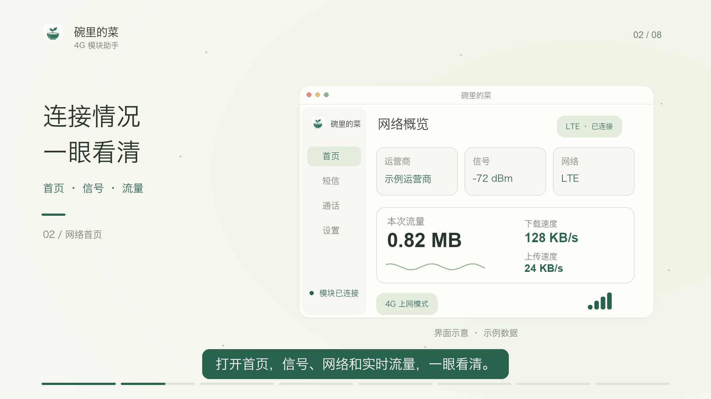

# 碗里的菜

把大疆第一代 4G 模块的网络和消息管理放进一个可以常驻后台的小工具。首页查看网络，短信和通话各有独立页面；关闭窗口后，服务继续运行。

基于 [DJOneHub](https://github.com/ZenGeekLabs/DJOneHub) 和 [VoHive](https://github.com/iniwex5/vohive) 继续开发。本项目是独立第三方工具，与 DJI、大疆、Quectel 或运营商无隶属关系。



画面为宣传动画中的界面示意，运营商、速率和流量均为示例数据。

## 下载与使用

下载 [v1.2.1 发布页](https://github.com/wanlidecai/wanlidecai-4g/releases/tag/v1.2.1) 中对应系统的 ZIP，无需安装开发环境。发布页也提供横屏、竖屏宣传视频。

[宣传动画源码与重新制作说明](promo/README.md)

| 系统 | 下载文件 | 使用方式 |
| --- | --- | --- |
| Apple 芯片 Mac，macOS 13 及以上 | `碗里的菜-Mac-1.2.1.zip` | 解压后将 `碗里的菜.app` 放到应用程序目录，双击启动；从菜单栏打开首页、短信或通话。 |
| Windows 10 / 11，Intel / AMD 64 位 | `碗里的菜-Windows-x64-1.2.1.zip` | 完整解压并保留 `runtime` 文件夹，双击 `碗里的菜.exe`；从右下角托盘打开页面。Windows 版仍待实机验证。 |

当前针对大疆第一代 4G 模块开发，已识别样机 USB ID 为 `2ca3:4006`。使用支持数据传输的 USB 线，并插入可用 SIM 卡。其他模块、固件和 SIM 的兼容性需要另行验证。

启动时不弹终端，也不自动打开浏览器或窗口。Mac 使用应用内窗口；Windows 在用户点击托盘入口后，用默认浏览器打开本机管理页。退出应用会停止它管理的后台服务；登录自启动需要在菜单栏或托盘中手动开启。

Mac 版本使用本机临时签名，尚未进行 Apple Developer ID 公证，首次启动可能需要在“系统设置 → 隐私与安全性”中允许打开。Windows 可能请求管理员权限，USB 串口 / RNDIS 驱动也需要正确安装；详细步骤见 [Windows 使用说明](windows-app/使用说明.txt)。程序不会自动替换 USB 驱动。

## 能做什么

- **网络首页**：集中查看运营商、信号、SIM、蜂窝网络、工作模式、实时上传 / 下载速度和本次运行流量。本次流量随后台服务重新启动而重新统计。
- **后台运行**：Mac 菜单栏、Windows 系统托盘常驻，关闭管理窗口后继续工作。
- **唤醒后检查连接**：先检查模块对应网卡的联网情况。网络正常就保持连接，不切换模式、不重启模块、不续租 DHCP；连续确认失联后才尝试恢复。短信模式、用户关闭 4G、手动停止服务、禁用网卡和静态 IP 设置会受到保留。
- **独立短信页**：消息列表、未读、搜索、详情、验证码复制和写短信。发送需要模块、SIM 和运营商支持，由用户点击发起。
- **独立通话页**：拨号盘、来电状态、接听 / 拒接 / 挂断控制及通话记录。控制能力取决于模块、固件、SIM 和运营商。
- **消息通知**：新短信、来电及未接来电可通过系统通知提醒，点击通知打开对应页面；需要允许系统通知，专注模式可能影响横幅和声音。
- **外观与设备管理**：浅色、深色、跟随系统，以及网络、设备信息、eSIM 和高级 AT 工具。

**电脑麦克风 / 扬声器的双向通话音频尚未实现。** 当前通话页提供控制和状态，不代表可以在电脑上直接听说。音频方案页面仅做只读评估，不会自动开启 ADB、修改模块 USB 配置或加载模块驱动。

## 验证范围

Apple 芯片 Mac 已完成应用构建、签名检查、后台运行和真实模块连接验证。共享后端与通知 / 唤醒逻辑有单元测试和演示流程验证；联网正常时的模拟唤醒确认没有重新切换网络。v1.2.1 将网络概览设为首页。

以下仍需实机验证：

- 电脑真实休眠后 USB 重新枚举，以及真实断网后的恢复过程。模拟唤醒不等同于完整休眠周期。
- 真实短信收发、电话拨打 / 接听和双向通话音频。
- Windows 的托盘、系统通知、USB 驱动、实际联网与真实休眠。当前已完成交叉编译和包校验。
- Intel Mac 与其他模块型号；本版没有提供 Intel Mac 安装包。

## 本地数据

管理服务仅监听本机：Mac 默认 `127.0.0.1:7575`，Windows 默认 `127.0.0.1:17575`。

Mac 后端数据位于 `~/Library/Application Support/DJOneHub/`，应用状态位于 `~/Library/Application Support/DJI4GHelper/`，日志位于 `~/Library/Logs/DJOneHub/`。Windows 后端数据位于 `%APPDATA%\DJOneHub`，助手日志位于 `%APPDATA%\DJI4GHelper\helper.log`。沿用原目录名称，便于旧版升级。

短信和通话记录缓存在本机 `communications.json`，最多保留 500 条短信与 100 条通话记录。载入历史记录不会补弹旧通知。提交问题截图或日志时，请遮挡号码、短信内容、验证码和 SIM / eSIM 标识。

## 从源码构建

源码分为三个部分：

| 目录 | 内容 |
| --- | --- |
| `mac-app/` | Swift 菜单栏应用、内置窗口、通知和唤醒恢复 |
| `windows-app/` | Go 托盘启动器、原生通知和 Windows 打包 |
| `windows-app/backend/` | 两个平台共用的 Go 后端、管理页面及模块通信 |

需要 Python 3、Go **1.26.3 或更新兼容版本**。构建只生成文件，不会启动服务或修改模块。

### Apple 芯片 Mac

需要 Xcode Command Line Tools、`pkg-config` 和 libusb 开发文件。使用 Homebrew 的环境可以先准备依赖：

```sh
xcode-select --install
brew install go pkg-config libusb
git clone https://github.com/wanlidecai/wanlidecai-4g.git
cd wanlidecai-4g
python3 mac-app/build.py --output build/碗里的菜.app
```

构建脚本重新编译共享后端和 Swift 应用，将本机 `pkg-config` 找到的 libusb 与许可证一并放入应用，最后执行本机临时签名及深度校验。可以用 `--go /path/to/go` 指定 Go；自定义 libusb 安装若没有完整许可文件，可加 `--libusb-license /path/to/COPYING`。也可用 `--runtime-source /path/to/碗里的菜.app/Contents/Resources/runtime` 复用已解压发布包的运行库，再重新编译本项目源码。

本地构建的最低 macOS 版本取决于实际使用的运行库，脚本会据此填写应用信息。例如本机 Homebrew 的 libusb 要求 macOS 15 时，构建结果也要求 macOS 15；上方发布包的 macOS 13 要求针对其随附的运行库。

打包构建结果：

```sh
ditto -c -k --keepParent --norsrc --noextattr build/碗里的菜.app 碗里的菜-Mac-local.zip
```

### Windows x64

可在 Windows 构建，也可在 Mac / Linux 交叉编译。准备官方 libusb 1.0 的 **Windows x64 DLL**，不要使用 macOS `.dylib`。仓库已包含 EXE 的品牌图标资源。

```sh
python3 windows-app/build.py --go /path/to/go --libusb-dll /path/to/libusb-1.0.dll
```

构建生成 `碗里的菜-Windows-x64-1.2.1/`、同名 ZIP 和包内 SHA-256 清单。可加 `--zadig /path/to/zadig-2.9.exe` 携带官方驱动工具；驱动安装仍由用户手动操作。

### 开发测试

在具备 libusb 开发环境的 Mac 上运行共享后端测试；Windows 启动器的共享逻辑测试可在主机上运行：

```sh
cd windows-app/backend
go test ./...
cd ..
go test -race .
```

这些测试不能代替 Windows 系统 API、真实 USB、短信、电话和休眠的实机验证。

## 许可与来源

项目沿用 [PolyForm Noncommercial License 1.0.0](LICENSE)，请阅读完整许可；公开源码不代表允许商业使用。上游署名与第三方组件许可见 [THIRD_PARTY_NOTICES.md](THIRD_PARTY_NOTICES.md)，各依赖保留自己的许可证。

```text
Required Notice: Copyright iniwex5 (https://github.com/iniwex5/vohive)
```
